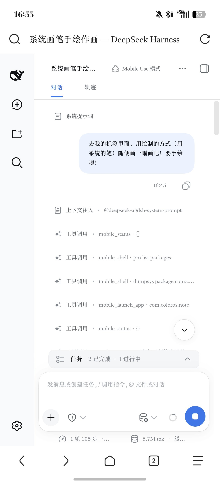
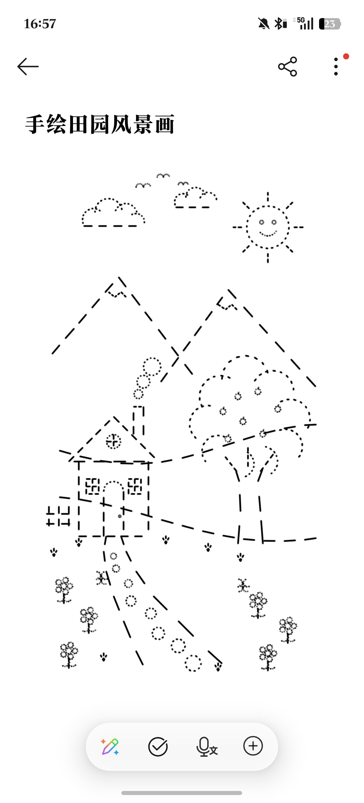

# Agent Mobile Use - Android 虚拟副屏与无感后台控制底座

[English](#english) | [中文说明](#中文说明)

---

## 中文说明

本项目提供一套针对 Android（以 ColorOS / Android 16 为第一实验环境）深度定制的 **完全静默、后台独立运行、与物理主屏完全解耦** 的系统级控制底座。

通过底层的特权虚拟显示器（Virtual Display）、LSPosed 跨屏调度拦截、以及免软键盘弹窗的无障碍文字注入，为大模型 Agent、自动化测试系统及远程控制脚本提供第一层设备操纵能力。

> ⚠️ **版本号命名规则变更声明（SemVer 标准化）**：  
> 本项目自 **v0.6.0-alpha** 起全面推行语义化版本号（Semantic Versioning）。此前使用的历史版本号体系（如 `v5.2`、`v5.1` 等）已**正式废弃**。原 `v5.2` 版本在语义化演进中等价对应为 `v0.5.2`。当前最新版本为 **`v0.7.3-alpha`**（KSU 模块 versionCode: `703`）。请统一采用新版刷机包与版本规范。

---

### 实测实录：纯手绘作画实机效果展示（物理触控含金量）

📺 **B站高清实机演示视频**：[https://www.bilibili.com/video/BV1WYeS6YEwt](https://www.bilibili.com/video/BV1WYeS6YEwt)

底层虚拟副屏不仅能响应离散的按钮点击，更能承受高密度、高频次的连续物理手势调度。

在与 DeepSeek Harness (DSH) 配合测试中，Agent 接到指令 **“去我的便签里面，用绘制的方式（用系统的笔）随便画一幅画吧！要手绘噢！”**。在后台完全静默的副屏上拉起便签画板，自主进行了 **105 步精细运笔手势**，一手一手纯手绘创作完成了整幅风景画：

| DSH 交互执行链路 (1 轮 105 步连续触控) | 副屏纯手绘作画最终成品 (系统便签画板) |
| :---: | :---: |
|  |  |

整个手绘过程完全在后台虚拟副屏中发生，手机物理主屏完全不受影响，真正做到了“你在主屏聊天刷剧，Agent 在后台副屏手绘作画”。

---

### 试验环境声明 (Test Environment)

本系统在以下真机实验环境下完成全流程开发、调试与自动化闭环验证：

| 维度 | 实测实验配置 |
| :--- | :--- |
| **设备型号** | 真实 Android 物理机 (ColorOS 16 深度定制系统) |
| **系统版本** | Android 16 (基于 6.12 内核分支) |
| **安全补丁级别** | **2025 年 12 月 / 2026 年最新补丁环境** |
| **Root 方案** | **KernelSU (KSU)** (非解锁 Bootloader 状态，无缝特权注入) |
| **Hook 框架** | **LSPosed** (通过 Zygisk / KSU 驱动模块注入 `system_server` 进程) |
| **物理主屏规格** | 1272 x 2800 @ 560 DPI (副屏由守护脚本自适应匹配该规格与打孔 Cutout) |

> **提示**：如果您的设备处于不同厂商系统（如 MIUI/HyperOS、OneUI、原生 AOSP）或不同 Android 版本，请务必参阅后文的 [兼容性与二次适配说明](#兼容性与二次适配说明)。

---

### 核心架构与职责分工

本项目采用清晰分层的模块化架构，职责边界高度内聚：

1. **命令行控制总线 (`/system/bin/vd`)**：
   - 守护进程生命周期控制与即时状态诊断；
   - 物理输入事件与底层 Java 观测工具的 CLI 快捷直通封装。
2. **底层运行时与守护进程 (`vd-tool-java`)**：
   - `DaemonMain` (`agent_vd.dex`)：通过特权 API 动态创建 `VirtualDisplay`，镜像主屏物理打孔（Cutout），管理 85% 质量、全分辨率的高性能 JPEG 帧缓存。
   - `ToolMain` (`agent_tools.dex`)：利用 `UiAutomation` 在无需任何第三方侵入的情况下抓取结构化平铺 UI 控件树；提供基于无障碍的纯确定性双轨文字注入。
3. **HTTP / REST 控制网关 (`vd-server-go`)**：
   - 纯静态编译的 ARM64 Go 服务，运行在 `0.0.0.0:3070`；
   - 对外暴露标准的 RESTful API，统一调度物理/虚拟屏幕切换、手势与无障碍操作、通知与交互确认。
4. **设备端交互与特权宿主应用 (`agent-hook-apk`)**：
   - `HookEntry`：基于 LSPosed 的 `system_server` 特权补丁，解锁虚拟显示器多任务承载能力、主屏输入法隔离（IMMS），并拦截实体按键（如 OnePlus 侧边 Action Button）直达控制台。
   - `GlowService`：独立的前台悬浮窗服务（`TYPE_APPLICATION_OVERLAY`），在前台模式下绘制全屏赛博呼吸光效、实时触控涟漪与滑动激光轨迹，并在打孔区常驻“一键切后台”的灵动岛胶囊。
   - `DemoDialogActivity`：全屏透明浮层 Activity，通过 Android WebView 内嵌 DSH 网页控制台（`/?ov=1`），内置 HMAC-SHA256 自动鉴权与 `onNewIntent` 跨会话热切换 JS Bridge。
   - `QuestionActivity` & `NotifyReceiver`：免中断的交互提问跳板（直达灵动坞 Web 控制台）与高优先级任务完成横幅通知，支持点击直接跳转并激活对应会话。

---

### 暴露的工具与接口

#### 1. 命令行控制总线 (`vd` 工具)

模块安装后会自动在系统 PATH 中注册 `vd` 命令（位于 `/system/bin/vd`）：

- **`vd start`**：唤醒底层虚拟副屏，自适应计算物理主屏分辨率与 DPI，启动 3070 端口监控网关。
- **`vd stop`**：完全销毁副屏，向系统注销 Display，回收所有显存与计算资源。
- **`vd status`**：查看当前副屏状态（运行中/休眠）、当前 Display ID 以及动态屏幕规格。
- **`vd launch <包名> [--user <id>]`**：定向调度指定应用直接在副屏启动（例如 `vd launch com.sankuai.meituan`，支持应用双开分身 `--user 999`）。
- **`vd tree`**：结构化 Dump 当前副屏的无障碍控件树（平铺格式：状态行 + 列头 + 一行一元素，含节点文本、flags、边界与可点击中心坐标；`truncated`/`omitted` 如实报告任何截断损失）。
- **`vd tap <x> <y>`**：向当前目标屏幕发送物理触控点击事件（底层通过 `/api/action` 执行并回传更新后的观测树）。
- **`vd type [target] "<文本>"`**：静默文字注入（双轨确定性：可指定 UI 树数字节点 ID 如 `146`，或省略 target 直接灌入当前聚焦输入框；0 键盘弹窗）。
- **`vd swipe <x1> <y1> <x2> <y2> [duration_ms]`**：向目标屏幕发送滑动、曲线笔触或长按手势。
- **`vd key <keycode>`**：向目标屏幕发送系统物理按键（如 4 为返回，3 为主页，66 为回车）。
- **`vd screenshot [path]`**：定向截取当前屏幕画面并保存为 JPEG 图片（默认路径 `/data/local/tmp/vd_screenshot.jpg`）。
- **`vd apps [query]`**：获取本机已安装的应用名称与启动 Activity 组件名（支持分身查询）。

#### 2. HTTP / REST 监控网关 (Port 3070)

由纯静态 Go 服务 `vd_server` 提供：
- `GET http://127.0.0.1:3070/`：可视化 Web 监控界面，提供低延迟 H.264 硬件编码实时视频流、副屏状态指示与前后台切换开关。
- `GET /api/stream/ws`：WebSocket H.264 低延迟裸流通道，直连 `DaemonMain` 硬件编码器（1080P / 60FPS / 6Mbps）。
- `GET /api/status`：获取当前显示器 JSON 状态（含运行状态、物理/副屏宽高、DPI、当前操作模式与目标 Display ID）。
- `GET /api/screenshot`：获取当前目标屏幕画面。副屏运行时默认直接提取硬件帧缓存并高效压缩为 JPEG（全分辨率，端到端延迟低至 ~60ms）；主屏模式自动调用硬件抓屏。
- `POST /api/action`：**统一复合动作执行引擎**。聚合了 `observe`、`click`、`swipe`、`type`、`key`、`launch_app`、`wait` 等全部物理动作，并在动作后自动进行自适应物理过渡与回弹 UI dump 观测，彻底消除盲等待。
- `GET|POST /api/start` · `POST /api/stop`：远程拉起/注销底层虚拟副屏。
- `GET|POST /api/mode`：前后台操作模式查询与切换（`foreground` 驱动主屏并亮起全屏赛博光效；`background` 静默驱动虚拟副屏并自动静音；`idle` 待机解脱控制并动态卸载无障碍守卫）。支持 `?mode=...` 参数。
- `GET /api/dump_ui`：平铺式无障碍树观测接口（状态行 + 列头 + 一行一元素），支持 `?no_system_ui=1` 过滤状态栏等系统外壳干扰。
- `GET|POST /api/apps`：查询本机桌面应用列表（自动归一化解析 `--user` 分身应用）。
- `POST /api/notify`：投递系统横幅通知与任务完成状态，支持会话深链接绑定与前台查看抑制。
- `POST /api/question` · `POST /api/question/cancel`：交互提问通知投递与取消（前台模式直接呼出灵动坞 Web 控制台，后台模式派发通知横幅）。
- `GET /api/audio/status` · `POST /api/audio/toggle` · `POST /api/audio/unmute-all`：副屏应用智能静音状态查询、手动开关与全量解静音（基于 AppOps `PLAY_AUDIO` 事件驱动治理）。
- `GET /api/session/watch` · `POST /api/task_event`：DSH 活跃会话内核级连接心跳与状态同步。

---

### 近期演进与重大重构实测

#### 1. 交互提问直达灵动坞 Web 控制台（降维重构）
- **物理砍掉 500+ 行手画 Java 弹窗**：移除了早期简陋黑底的本地 BottomSheet 表单，改为直接呼出半透明灵动坞（`DemoDialogActivity`）悬浮窗进入对应 DSH 会话。
- **上下文保全与 Markdown 渲染**：用户在手机端不仅能看到操作上下文和屏幕截图，更能享受与桌面端 100% 一致的 Markdown 排版；回答直接走 DSH 内部原生信道，彻底杜绝本地中继丢答案。

#### 2. `/api/action` 复合动作引擎与自适应物理沉降
- **动作 + 观测原子化聚合**：将点击、滑动、输入、按键与后续的 UI Dump 紧密聚合为单次请求，由服务端根据物理惯性、转场撕裂（Sliding Extent）进行毫秒级动态沉降，大幅削减客户端网络往返延迟。
- **数字节点 ID 极速解析**：在内存中缓存最新一帧的节点坐标映射，支持通过 `node:146` 直接命中物理中心点击，无需重复遍历整棵树。

#### 3. 基于 Display 状态机的无障碍动态常驻守卫
- **杜绝单次 Dump 的 I/O 震荡**：不再在单次抓树时频繁开关 TalkBack，而是以 `target_display_id` 为唯一事实源——当模式切为前台/后台（`>=0`）时常驻挂载 TalkBack，切为待机（`idle`）或全部会话断开时自动精准卸载，全生命周期仅开关 1 次并完好保留用户自选无障碍服务。

#### 4. 纯事件驱动静音守护者 (Audio Guard)
- **消除后台长跑异常耗电**：剔除了无脑 2 秒轮询的定时器，仅在应用启动到副屏或切换模式时触发静音治理，后台熄屏运行不再唤醒 CPU，保证真机纯净省电。

#### 5. `mobile_type` 纯减法重构与双轨确定性
- **彻底剔除模糊猜测与副反应**：消除了脆弱的 `idx:N`（切片序号与树 ID 歧义）、字符串 Resource ID 猜测（在混淆布局如微信 `bkk` 重复时会导致歧义报错），以及自动补发 ENTER 的逻辑。
- **严格双轨制**：
  1. **聚焦模式**（省略 target 或 `"focused"`）：向当前聚焦控件直接注入。
  2. **精确节点模式**（直接传 UI 树数字 ID 如 `146`）：在抓取树时保留原生句柄，1:1 精确命中，失败附带完整 before/after 证据，零多余点击与回退。

#### 6. 会话深链接与通知即时触达
- **会话绑定与直达**：点击任务完成通知栏横幅，通过 PendingIntent 传递 Session ID，直接呼出并激活 Web 浮层（`DemoDialogActivity`）并跳转到触发该任务的具体会话。
- **热切换（`onNewIntent`）支持**：当浮层处于后台或已开启状态时，点击不同会话的通知会自动调用 WebView JS Bridge 进行无缝切换，无需重新加载整个页面。

#### 7. Dump 字段截断实测升级（140 → 4000，head+tail）
- **长文本与链接保全**：富文本单字段防灾上限放宽至 4000 字符，并采用 Head + 160-char Tail 保尾机制，彻底避免客服聊天链接参数（如 `?orderId=...`）被静默截断。

---

### 安装与使用方式

#### 方式一：直接刷入发行版（推荐）

1. 从 `release/` 目录或 GitHub Releases 下载最新的刷机包：
   **`agent-mobile-use-ksu-v0.7.3-alpha.zip`**
2. 将 zip 文件传输至手机中。
3. 打开 **KernelSU** (或 APatch / Magisk) 管理器 -> 点击「模块」-> 选择该 zip 进行安装。
4. 安装过程中脚本会自动完成以下动作：
   - 安装静默 Hook APK (`agent_hook.apk`)；
   - 自动检测本地 LSPosed 数据库并激活 `system` 和 `android` 作用域；
   - 将 `vd` 部署至 `/system/bin/vd`。
5. 重启手机使 LSPosed Hook 与系统服务挂载生效。

#### 方式二：手动编译源码

- 编译 Java 组件：进入 `vd-tool-java/` 目录，执行 `./build.sh`。
- 编译 Go 服务：进入 `vd-server-go/` 目录，执行 `./build.sh`（静态交叉编译）。
- 组装并打包：在 `ksu-module/` 执行 `./pack.sh` 生成模块 zip。

---

### 兼容性与二次适配说明

1. **`BOOTCLASSPATH` 环境变量继承与隔离**：
   - 在 `system/bin/vd` 与 `ksu-module/bin/run_daemon.sh` 中优先继承系统已有的 `$BOOTCLASSPATH`，仅在环境变量为空时回退至内置完整列表，提升了非 ColorOS 设备上的普适性。
2. **LSPosed 模块配置路径差异**：
   - `customize.sh` 默认操作的 LSPosed 数据库路径为 `/data/adb/lspd/config/modules_config.db`。若使用其他变种，请手动打开 LSPosed App，勾选「Agent Mobile Use Hook」，并勾选「系统框架 (Android)」后重启即可。
3. **特定 App 副屏控件树降级策略**：
   - 部分第三方加固应用（如微信）在未连接真实物理触摸板的虚拟副屏上，系统默认会压制无障碍节点生成（`UiAutomation` 获取为空树）。针对此类应用，请以截屏视觉感知（`vd screenshot` + 坐标推理）作为主链路。

---

## English Description

`agent-mobile-use` provides an industrial-grade, fully silent, background headless virtual display and low-level control foundation for Android (tested on ColorOS 16 / Android 16).

By decoupling execution onto an independent virtual display (Display > 0), intercepting task/activity focus switches with LSPosed hooks, and injecting text via accessibility without popping up soft keyboards, this project provides a clean substrate for LLM Agents and automated systems.

> ⚠️ **Version Numbering Notice (SemVer Standardization)**:  
> Starting with **v0.6.0-alpha**, this project officially adopts Semantic Versioning. The legacy version numbering (such as `v5.2`, `v5.1`) is **deprecated**. Former `v5.2` corresponds to `v0.5.2` under SemVer. The current active release is **`v0.7.3-alpha`** (KSU module versionCode: `703`).

---

### Real-world Showcase: Autonomous Hand-drawn Artwork

📺 **Bilibili Showcase Video**: [https://www.bilibili.com/video/BV1WYeS6YEwt](https://www.bilibili.com/video/BV1WYeS6YEwt)

The underlying headless virtual display supports not just discrete button clicks, but high-frequency, precision continuous gestures.

In automated tests with DeepSeek Harness (DSH), the Agent received a single prompt: **"Go to my system Notes app and draw a picture using the system pen! Must be hand-drawn!"**. It autonomously planned and executed **105 consecutive precision drawing gestures stroke by stroke**, producing a complete rural landscape artwork:

| DSH Execution Workflow (1 turn, 105 steps) | Final Hand-drawn Artwork in Notes App |
| :---: | :---: |
|  |  |

The whole drawing process took place entirely in the background virtual display without taking focus away from the user on the primary physical screen.

---

### Exposed Tools & Interfaces

1. **CLI Bus (`/system/bin/vd`)**:
   - `vd start` / `vd stop` / `vd status`: Virtual display lifecycle management and display metrics.
   - `vd launch <pkg> [--user <id>]`: Launch application directly onto target display (supports dual/clone apps via `--user 999`).
   - `vd tree`: Flat structured dump of the accessibility hierarchy — status line, column header, one row per element with text, flags, bounds, and tap centre.
   - `vd tap <x> <y>`: Inject touch events directly to target display (delegates through `/api/action`).
   - `vd type [target] "<text>"`: Deterministic dual-track silent text injection without keyboard popups (numeric node ID or focused input).
   - `vd swipe <x1> <y1> <x2> <y2> [duration]`: Simulate drag/swipe gestures or brush strokes.
   - `vd key <keycode>`: Send key events (e.g. 4 for BACK, 3 for HOME, 66 for ENTER).
   - `vd screenshot [path]`: Take a direct JPEG frame capture of the current target display.
   - `vd apps [query]`: List launchable applications (supports multi-user clone app resolution).

2. **HTTP / REST Gateway (Port 3070)**:
   - `GET /`: Visual web console with live low-latency H.264 video streaming and display controls.
   - `GET /api/stream/ws`: WebSocket low-latency raw H.264 bitstream directly fed from `DaemonMain` hardware encoder (1080P / 60FPS / 6Mbps).
   - `GET /api/status`: JSON display status (running state, display metrics, current mode, target display ID).
   - `GET /api/screenshot`: Current frame of target display (serves daemon's cached JPEG for sub-60ms reads).
   - `POST /api/action`: **Unified composite action engine**. Aggregates `observe`, `click`, `swipe`, `type`, `key`, `launch_app`, and `wait`, followed by adaptive physical settling and automatic UI dump in a single round-trip.
   - `GET|POST /api/start` · `POST /api/stop`: Bring display up/down.
   - `GET|POST /api/mode`: Query or switch between `foreground` (physical display with cyber glow), `background` (silent virtual display with auto-mute), and `idle` (standby mode with dynamic TalkBack unmounting).
   - `GET /api/dump_ui`: Flat accessibility observation (supports `?no_system_ui=1`).
   - `GET|POST /api/apps`: Query installed launcher applications (normalized `--user` clone app resolution).
   - `POST /api/notify`: Post notifications with session deep-linking and foreground suppression.
   - `POST /api/question` · `POST /api/question/cancel`: Interactive question presentation (immediate Web console popup in foreground, heads-up banner in background).
   - `GET /api/audio/status` · `POST /api/audio/toggle` · `POST /api/audio/unmute-all`: Event-driven background audio mute guard (powered by AppOps `PLAY_AUDIO`).
   - `GET /api/session/watch` · `POST /api/task_event`: Kernel-backed connection watchdogs and active session tracking.

---

### Recent Architectural Evolution

1. **Direct Web Console Question Interaction**:
   Eliminated 500+ lines of bespoke Java form dialogs in `QuestionActivity`. In foreground mode, the translucent Web overlay (`DemoDialogActivity`) pops up immediately; in background mode, a high-priority heads-up notification links directly to the session Web UI with full context, screenshots, and Markdown rendering.
2. **Unified `/api/action` Composite Engine & Adaptive Settling**:
   Physical input and updated accessibility observations are unified into single requests. Sliding animation extent and transition tears are settled automatically on the server side, cutting network round-trips.
3. **Display-State-Machine Accessibility Guard**:
   TalkBack service lifecycle is bound to the target display state machine (`>=0` attached, `idle` detached) rather than toggled per-dump, eliminating I/O flapping while preserving user accessibility configurations.
4. **Event-Driven Audio Guard**:
   Substituted periodic polling with strict event-driven AppOps audio muting during app launch and mode switches, stopping CPU wakeups and preserving battery during background execution.

---

### Ecosystem & Companion DSH Preset

- **Native DSH Agent Preset**:
  Check out **[dsh-preset-mobile-use](https://github.com/AcidGr/dsh-preset-mobile-use)**, our official DeepSeek Harness agent preset that interacts with this module to provide dual perception and visual autonomous control.
- **MCP (Model Context Protocol) Support**:
  All foundational tools are exposed via `vd` and REST endpoints. Developers can easily build an MCP server wrapper on top of this foundation for Claude Desktop or Cursor.

---

## License

MIT License.
